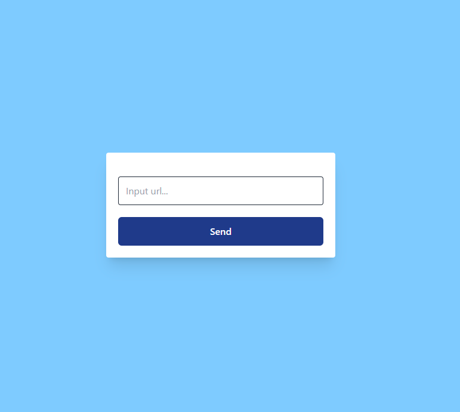

## Запуск проекта

Запустить контейнеры
```
docker compose up -d
```

Установить зависимости
```
docker compose exec fpm composer install
```

Переименовать .env.example файл для найстроки подключения к БД
```
cd ShortLink
cp .env.example .env
```

Сгенерировать ключи
```
docker compose exec fpm php artisan key:generate
```

Собрать стили и js
```
docker compose exec fpm npm install
docker compose exec fpm npm run dev
```

## Результат


Форма отправляет url на сервер, и ищет по базе совпадения по url. 
Если ссылка на такой url уже была создана, то вернет уже готовую ссылку.
Если в таблицу записи с таким url не обнаружено, то сгенерирует ссылку, запишет
в таблицу и вернет ссылку клиенту на страницу. 
Отправка формы  реализована асинхронным запросом через JS.